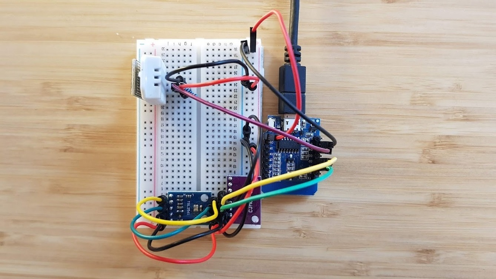

# esp8266-sensor-station

A collection of sensors on an ESP8266 board, communicating through MQTT.
Currently supported sensors are:

* DHT22 for humidity and temperature,
* TSL2561 for luminosity,
* CCS811 for eCO2 and TVOC

## Wiring

## Getting Started

In `./lib` create two header files `wifi_secrets.h` and `mqtt_secrets.h` and fill out the definitions.
